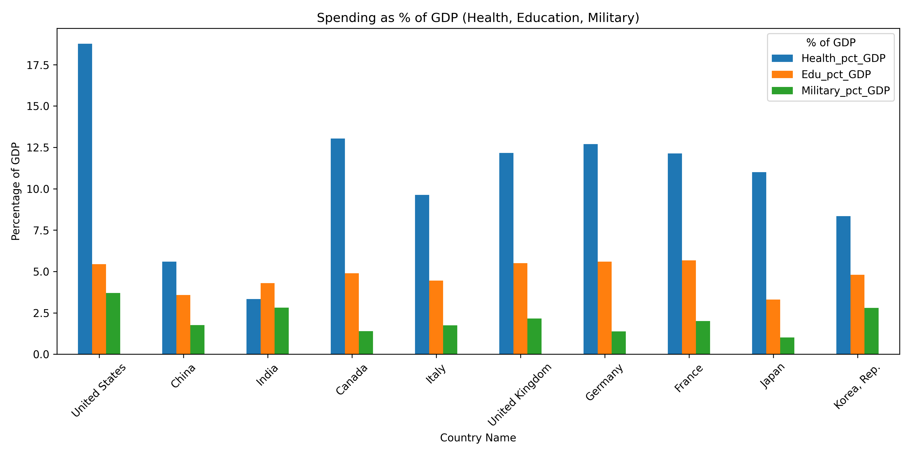
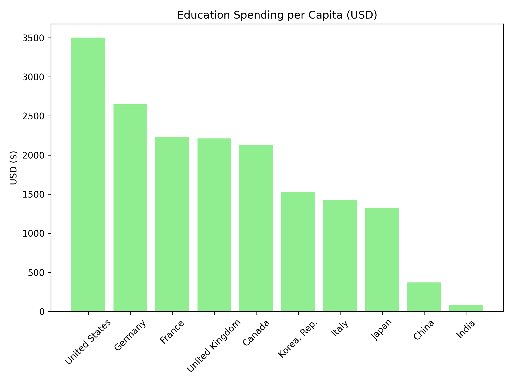
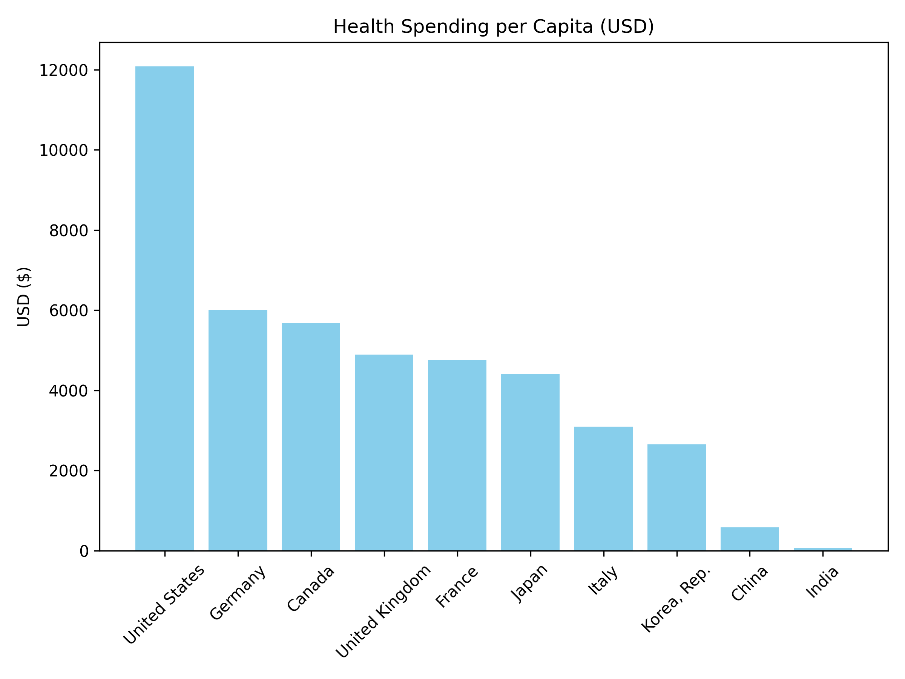

# Government Spending Comparison Analysis

This project compares health, education, and military spending across selected countries using Python, public datasets, GDP-based metrics, and per-capita analysis.

## Project Overview

The goal of this project was to analyze how countries allocate spending across health, education, and military categories. The analysis compares spending as a percentage of GDP, per-capita spending, and country-level differences.

This project demonstrates data cleaning, comparative analysis, Python-based visualization, and presentation of findings using real-world public datasets.

## Tools Used

- Python
- Pandas
- Matplotlib
- CSV and Excel datasets
- PowerPoint
- Public spending datasets

## Questions Explored

- How do countries compare in health, education, and military spending?
- Which countries spend the most per person in each category?
- How does military spending compare with health and education spending?
- Which countries spend the highest percentage of GDP on each category?
- What patterns appear when spending is adjusted by population and GDP?

## Project Preview

### Spending as Percentage of GDP

### Education Spending Per Capita

### Health Spending Per Capita

## Skills Demonstrated

- Python data analysis
- Data cleaning
- Data visualization
- Comparative analysis
- GDP-based analysis
- Per-capita analysis
- Public dataset analysis
- Reporting and presentation design

## Project Files

- `government-spending-presentation.pptx` - Final project presentation
- `cleaned-per-capita-spending.csv` - Cleaned per-capita dataset
- `education-per-capita.png` - Education spending visualization
- `health-per-capita.png` - Health spending visualization
- `pct-gdp-spending.png` - Spending as percentage of GDP visualization
- `project-presentation.mp4` - Project presentation video
- `code-walkthrough.mp4` - Code walkthrough video
- `military-spending-raw.xlsx` - Raw military spending dataset

## Data Sources

This project uses public spending datasets related to health, education, and military expenditures. The data was cleaned and combined to support comparisons across countries using GDP-based and per-capita metrics.

## Summary

This project demonstrates my ability to use Python and public datasets to analyze spending patterns, create visualizations, and communicate findings clearly through charts, a presentation, and a code walkthrough.

## Disclaimer

This project was created for educational and portfolio purposes.
